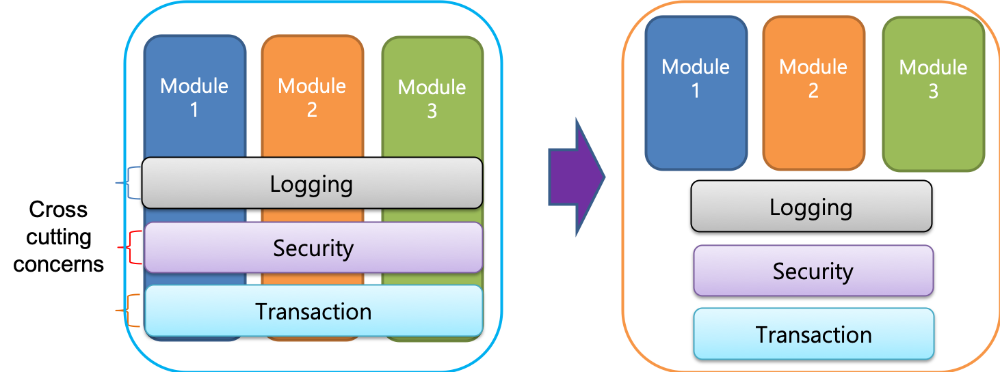

# SPRING
## AOP

### AOP 이란?



Aspect Oriented Programming의 약자이다.
각각의 모듈들과 분리시켜 **독립된 클래스**로 분리시킨다.


```java
   class Bank {
       private int balance;
       public void withdraw(int amount) {
           bankLogger.info("Withdraw –" + amount);
           tx.begin();
           balance = this.balance-amount;
           accoutDao.saveBalnace(balance);
           tx.commit();
       }
   }
```
위의 코드에는 트랜잭션, 로깅, 비즈니스로직의 코드가 하나의 클래스 안에 섞여있다.  
Bank클래스는 지금 너무 많은 일을 하고있다.  
클래스가 한가지 일에만 집중할 수 있도록 기능들을 각각의 독립된 클래스로 분리시켜 개선시켜보자.
```java
    bankLogger.info("Withdraw –" + amount);
```   

```java
    tx.begin();
    tx.commit();
``` 

```java
   class Bank {
       private int balance;
       public void withdraw(int amount) {
           balance = this.balance-amount;
           accoutDao.saveBalnace(balance);
       }
   }
```    
코드를 모두 분리시켰지만 정상적인 실행을 위해 런타임시에 위의 코드 순서와 같이 호출시켜야 한다.  
이렇게 분리시키는것을 **Aspect**라고 한다.

#### AOP에 사용되는 용어 정의

- **joinpoint** : application의 target이 되는 app function을 말한다. 
- **advice** : joinpoint 앞에 수행되는 것을 **befor advice**, 뒤에 수행되는 것을 **after advice**, 둘다 실행하는 것을 **around advice**라고한다.
- **pointCut** : joinpoint들을 하나의 expression으로 표현한 것, pointcut이 수행되기전에 advice가 먼저 수행된다.
위의 정보를 담고있는 클래스를 Aspect라고 한다.

#### PointCut Expression pattern

```java
@Pointcut("execution(*.aspects.trace.demo.*.*(...)")
public void traceMethodsIndemoPackage() {}
```  

### Aspect를 사용하는 2가지 방법

#### xml 설정으로 aspect 설정하기

- aspect dependency 추가
```xml
<!-- pom.xml -->
<dependency>
   <groupId> org.springframework </groupId>
   <artifactId> spring-aspects </artifactId>
   <version> ${org.springframework-version} </version>
</dependency>
```  
maven을 사용하여 pom.xml에 spring-aspects dependency를 추가해준다.

- aspect 선언

- pointcut 선언

- advice 선언

#### Annotation으로 aspect 설정하기

- aspectj Annotation 기능 활성화하기

- pointcut 선언하기

- advice 선언하기


