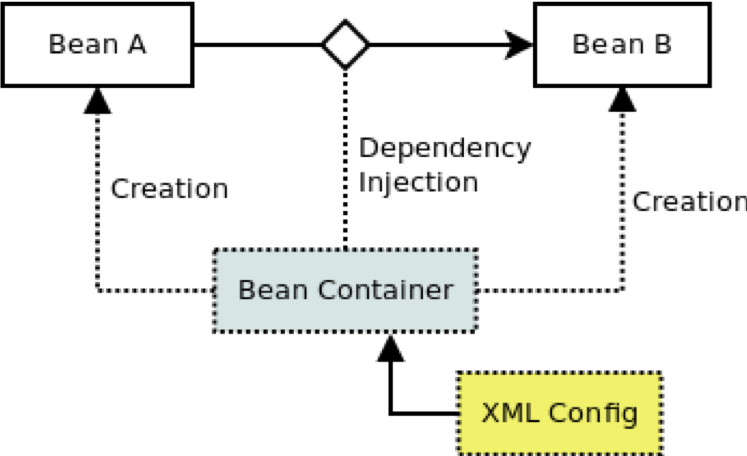
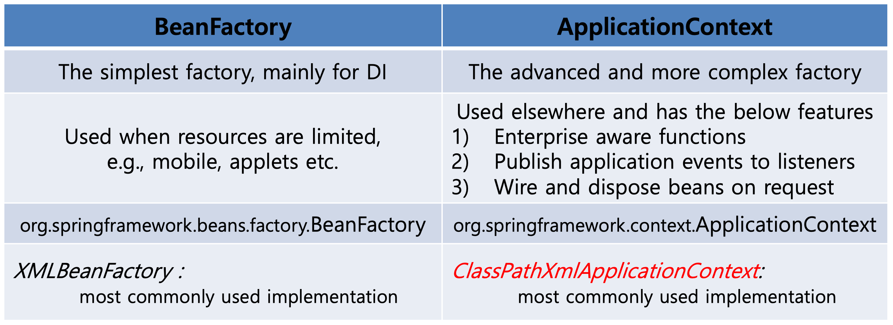
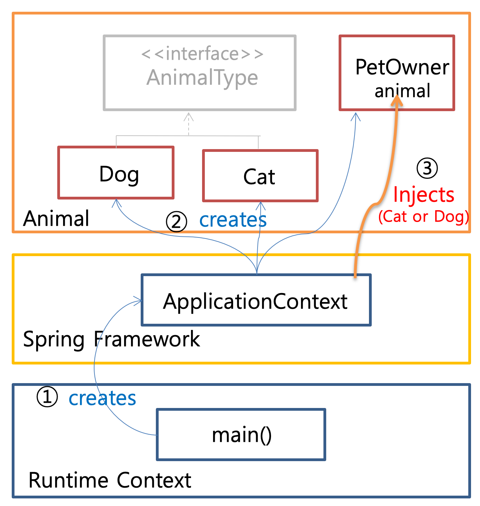

# SPRING
## Dependency Injection

### Dependency Injection 이란?
A클래스에서 B클래스에게 의존(depend)을 할 경우, 내부에 존재하는 필드(멤버 변수)에게 외부에서 값을 주입시켜주는 것을 말한다.
위에 말로는 설명이 부족하다. 아래 코드를 보며 이해해보겠다.

```java
public class PetOwner {
    private AnimalType animal;
    
    public PetOwner() {
        /* 의존성 주입에서는 new 생성자를 사용하지 않는다. */
        this.animal = new Dog(); 
    }
}
```
위의 코드는 의존성주입이 아닌 의존성 주입을 이해하기 위한 코드이다.  
위에 코드를 보면 현재 PetOwner()객체는 AnimalType객체에게 의존하고있다.
이러한 의존을 **의존성**이라고 하며, animal이라는 필드에게 값을 외부에서 넣어주는 것을 **주입**이라고한다.  
이 말을 합쳐 **의존성 주입, Dependency Injection**이라고 말한다.   
DI는 Spring framework에 의해 지원하는 디자인패턴이다.  
DI를 통해 많은 객체들 사이의 coupling을 줄이고 framework에 의해 동적으로 의존성을 주입할 수 있다.
 
이제 좀 더 의존성 주입에 대해 알아보자.  
****



위 그림을 보게되 Spring Container에서 각각의 객체 Bean A와 Bean B를 생성하고 A객체에서 B객체 사이에 외부에서 **의존성 주입**을한다. 
이러한 설정은 위 그림에서는 xml config 파일 설정으로 한다.  
위 그림을 코드로 살펴보자.

```java
public class Dog implements AnimalType {
    ...
    }
```

```java
public class Cat implements AnimalType {
    ...   
    }
```

```java
public class PetOwner {
    private AnimalType animal;
    
    public PetOwner(AnimalType animal){
        this.animal = animal;
        }
    }
```


Bean Container에서는 위와 같이 Cat, Dog 객체를 생성한 후 PetOwner객체로 AnimalType의 animal필드에게 의존성주입을 하게된다.

### Spring Container
Spring Container는 Spring 프레임워크의 핵심 컴포넌트이다.
주요기능으로 1. 객체를 생성 및 관리 2.객체의 의존성 주입이 있다.  
Spring Container는 xml과 annotations등으로 표현할 수 있다.
객체를 관리하기 위해서 Container는 DI를 사용한다.

또한, Spring Container는 2가지의 타입이 있는데
* BeanFactory
* ApplicationContext  
로 나뉜다.  



ApplicationContext를 사용하여 container를 생성할 때는 아래의 코드를 사용한다.

```java
ApplicationContext context = new ClassPathXmlApplicationContext("[xml config path]");

PetOwner person = (PetOwner) context.getBean("[bean id]");
```

new ClassPathXmlApplicationContext()의 인자로 xml config파일 경로를 넣어주고, context.getBean()메소드를 통해 bean의 id를 인자로 넘겨
bean을 받아온다.  

### Spring Container와 Dependecy Injection 순서도



위 그림을 설명하자면 main함수가 호출된 이후에 ApplicationContext가 container를 생성하고 생성된 container가 Dog객체와 Cat객체를 생성한다. 이후에 PetOwneranimal 클래스에서 의존성주입을 한다.


### Dependency Injection의 장점
* 의존성을 줄일 수 있다.
  - 의존성의 감소는 모든 코드를 수정해야하는 번거러운 일 감소에 비례한다.(즉, DI를 통해 많은 코드를 수정하지 않을 수 있다.)
* 코드의 재사용성
  - 어떠한 인터페이스가 다른 곳에서도 구현이 필요할 경우 DI를 통해 코드를 변경할 필요가 없다.
* 읽기 쉬운 코드를 만들어준다.
* 테스트에 용이하다.
* 결합도(coupling)을 줄이면서 확장성을 높일 수 있다.  
등등 정말 수도 없이 많은 장점이 있다.